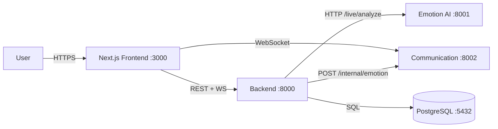

# Luna Emotion Companion

> A real-time, multi-service emotion companion platform with live emotion
> tracking and WebRTC voice/video calling.

---

## 1. What it is

Luna Emotion Companion is a full-stack application that combines conversational
AI, real-time emotion analysis, and peer-to-peer voice/video calling. A Next.js
frontend connects to a FastAPI backend that orchestrates an Emotion AI inference
service and a Communication service (WebSockets + WebRTC signaling), all backed
by PostgreSQL.

## 2. Product features

- **Conversational companion** — chat with the AI, persisted per user.
- **Emotion analysis** — analyze voice and video samples; store emotion records
  and mood insights.
- **Live emotion tracking** — real-time camera/mic analysis streamed back to the
  authenticated user over a WebSocket.
- **WebRTC calling** — in-app voice/video calls with signaling relayed through
  the Communication service, media peer-to-peer.
- **Presence & notifications** — online status, private/broadcast messaging, and
  delivery/read acknowledgements.

## 3. System architecture



See [`docs/ARCHITECTURE.md`](docs/ARCHITECTURE.md) for the full architecture,
live emotion pipeline, and WebRTC signaling flow.

## 4. Service architecture

| Service | Path | Stack | Port |
|---------|------|-------|------|
| Frontend | `frontend/` | Next.js (React) | 3000 |
| Backend | `services/backend/backend/` | FastAPI + Postgres | 8000 |
| Emotion AI | `services/ai/emotion-ai-service/` | FastAPI | 8001 |
| Communication | `services/communication/` | FastAPI + WS + WebRTC | 8002 |

All four services share a single HS256 `SECRET_KEY` / `ALGORITHM` so JWTs are
trusted cross-service. The Communication service is a Python namespace package
run via `communication.main:app` from `services/communication/`.

## 5. Technology stack

- **Frontend:** Next.js, React, TypeScript
- **Backend / AI / Communication:** Python, FastAPI, Uvicorn, SQLModel /
  SQLAlchemy, Alembic
- **Realtime:** WebSockets, WebRTC
- **Data:** PostgreSQL 16
- **AI:** wav2vec2 audio emotion model, video emotion models, OpenAI (optional)
- **Ops:** Docker (Postgres), PowerShell launch scripts, GitHub Actions CI

## 6. Repository structure

```
Luna_EmotionCompanion/
├── frontend/                         # Next.js app
├── services/
│   ├── ai/emotion-ai-service/        # FastAPI AI :8001
│   ├── backend/backend/              # FastAPI Backend :8000
│   └── communication/                # FastAPI+WS Comm :8002 (namespace pkg)
│       └── communication/
│           └── main.py               # run via communication.main:app
├── scripts/                          # start-all.ps1, stop-all.ps1, health-check.ps1
├── docker/                           # Docker assets (to be added)
├── tests/integration/                # Integration tests
├── docs/                             # Architecture, API, runbook, etc.
├── .github/workflows/ci.yml          # CI
├── README.md
├── docker-compose.yml
└── LICENSE
```

## 7. Install dependencies

### Python services (per service)

```bash
# Emotion AI
cd services/ai/emotion-ai-service
python -m venv .venv-ai
.venv-ai\Scripts\activate
pip install -r requirements.txt

# Backend
cd services/backend/backend
python -m venv .venv-backend
.venv-backend\Scripts\activate
pip install -r requirements.txt

# Communication
cd services/communication
python -m venv .venv-comm
.venv-comm\Scripts\activate
pip install fastapi "uvicorn[standard]" redis aiortc
```

### Frontend

```bash
cd frontend
npm install
```

## 8. Environment variables

Copy each service's `.env.example` to `.env` (git-ignored) and fill in real
values. The critical rule: **`SECRET_KEY` and `ALGORITHM` must be identical
across all three Python services.** Never hardcode a real secret in source.

See [`docs/ENVIRONMENT_SETUP.md`](docs/ENVIRONMENT_SETUP.md) for the full table
of variables per service.

## 9. How to start

From the repo root (Windows + PowerShell 5.1+):

```powershell
.\scripts\start-all.ps1
```

This starts PostgreSQL (Docker), AI :8001, Backend :8000, Communication :8002,
and the Frontend :3000. Open <http://localhost:3000>.

Stop with `.\scripts\stop-all.ps1`; verify with `.\scripts\health-check.ps1`.

## 10. Service ports

| Service | Port |
|---------|------|
| Frontend | 3000 |
| Backend | 8000 |
| Emotion AI | 8001 |
| Communication | 8002 |
| PostgreSQL | 5432 |

## 11. API overview

Backend REST base: `http://localhost:8000/api/v1`. Key groups: `auth`, `users`,
`emotions`, `ai`, `analysis`, `conversations`, `insights`. Full listing in
[`docs/API_CONTRACT.md`](docs/API_CONTRACT.md).

## 12. WebSocket overview

Communication WS: `ws://localhost:8002/ws/{user_id}?token=<jwt>`. Events:
`chat_private_message`, `chat_room_message`, `chat_ack`, `chat_read_ack`,
`presence_update`, `broadcast`, `notification`, `status`, `ping`/`pong`,
`heartbeat`/`heartbeat_ack`, `error`.

## 13. WebRTC overview

Signaling events relayed over the WS: `call_start`, `call_accept`, `call_reject`,
`call_end`, `media_mute`/`media_unmute`, `camera_on`/`camera_off`,
`webrtc_offer`, `webrtc_answer`, `webrtc_ice_candidate`. Media connects
peer-to-peer between the two browsers.

## 14. AI pipeline

The Emotion AI Service (`/live`, `/speech`, `/video`) validates the shared JWT
and performs emotion inference. `AI_PROVIDER=mock` only affects the text-LLM
path; the live emotion pipeline is real and independent of it.

## 15. Live emotion pipeline

Frontend → `POST /api/v1/analysis/live` (Backend) → `/live/analyze` (AI) →
Backend persists + `POST /internal/emotion` to Communication → WS
`live_emotion_update` → Frontend. The Backend targets `current_user.email`
(the JWT `sub`) so the event reaches the correct socket.

## 16. Database

PostgreSQL with SQLModel/SQLAlchemy models and Alembic migrations
(`services/backend/backend/alembic`). Apply with `alembic upgrade head`.

## 17. Testing

- Unit/integration tests live under `services/*/tests` and `tests/integration/`.
- Run the Backend suite from `services/backend/backend` with `pytest`.
- See [`docs/RUNBOOK.md`](docs/RUNBOOK.md) for end-to-end demo/verification steps.

## 18. Deployment

Docker Compose orchestrates Postgres, Backend, AI, Communication, and Frontend.
See [`docs/DEPLOYMENT.md`](docs/DEPLOYMENT.md) for compose shape, environment
variables, and scaling notes (Redis Pub/Sub planned for multi-replica WS).

## 19. Development workflow

1. Create a feature branch.
2. Set up each service's `.env` from `.env.example` (shared `SECRET_KEY`).
3. `.\scripts\start-all.ps1` to run the stack.
4. Make changes; the Frontend and uvicorn workers hot-reload.
5. `.\scripts\health-check.ps1` and manual demos before opening a PR.
6. CI runs in `.github/workflows/ci.yml`.

---

## Further reading

- [Architecture](docs/ARCHITECTURE.md)
- [API Contract](docs/API_CONTRACT.md)
- [AI Module](docs/AI_MODULE.md)
- [Communication Module](docs/COMMUNICATION.md)
- [Environment Setup](docs/ENVIRONMENT_SETUP.md)
- [Deployment](docs/DEPLOYMENT.md)
- [Runbook](docs/RUNBOOK.md)
