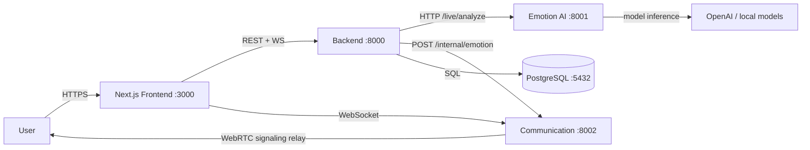
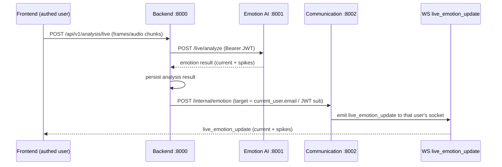
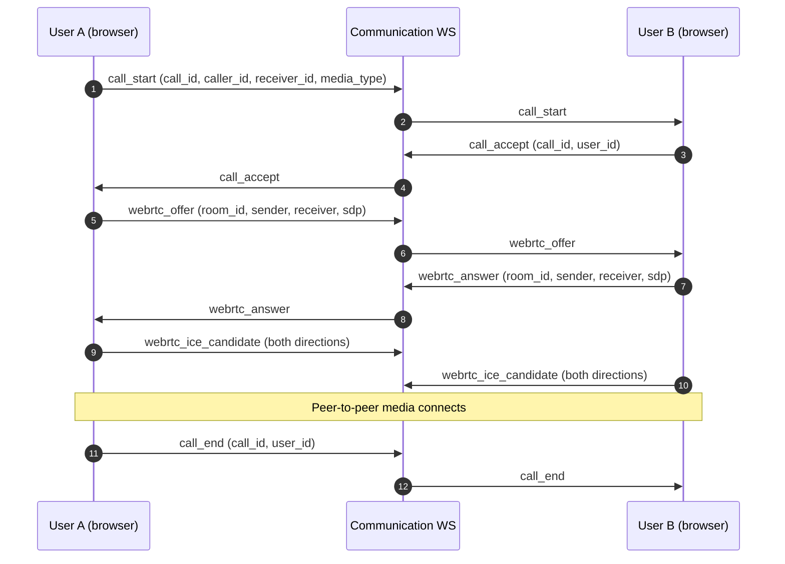

# Luna Emotion Companion — Architecture

This document describes the system-level and service-level architecture of the
Luna Emotion Companion monorepo, including the real-time **live emotion
pipeline** and the **WebRTC signaling flow**.

---

## 1. System Overview

Luna Emotion Companion is a multi-service, real-time emotion-analysis platform.
A Next.js frontend lets users log in, hold conversations, run live emotion
tracking (camera/mic), and place WebRTC voice/video calls. Four backend
services (AI, Backend, Communication, Frontend) share a single HS256
`SECRET_KEY`/`ALGORITHM` so JWTs issued by the Backend are trusted by every
service.

| Layer | Component | Stack | Port |
|-------|-----------|-------|------|
| UI | Frontend | Next.js (React) | 3000 |
| API | Backend | FastAPI + Postgres (SQLAlchemy / Alembic) | 8000 |
| AI | Emotion AI Service | FastAPI (wav2vec2 / audio + video models) | 8001 |
| Realtime | Communication | FastAPI + WebSockets + WebRTC signaling | 8002 |
| Data | PostgreSQL | PostgreSQL 16 | 5432 |

---

## 2. System Architecture (High Level)

- **Frontend** talks to the Backend over REST (`/api/v1/...`) and to the
  Communication service over a WebSocket (`/ws/{user_id}?token=...`).
- **Backend** is the system of record: auth, persistence (Postgres), and
  orchestration. It calls the AI service for analysis and the Communication
  service to push real-time events.
- **AI** performs emotion inference from audio/video frames. It is stateless
  with respect to the rest of the stack and trusts only the shared JWT.
- **Communication** relays WebSocket events and WebRTC signaling between
  authenticated users. Targeted delivery uses the JWT `sub` (email) as the
  socket identity.

---

## 3. Service Architecture

### 3.1 Backend (`services/backend/backend`)
- FastAPI app exposed at `/api/v1`.
- SQLModel / SQLAlchemy models with Alembic migrations.
- Issues HS256 JWTs on login; verifies them on every protected route.
- Proxies analysis requests to the AI service and persists results.
- Forwards live emotion results to the Communication service for push.

### 3.2 Emotion AI Service (`services/ai/emotion-ai-service`)
- FastAPI app (`main:app`) with routers: `/health`, `/live`, `/speech`,
  `/video`.
- Validates the shared JWT before serving analysis requests.
- First run downloads the wav2vec2 model (~once).

### 3.3 Communication (`services/communication/communication`)
- Python namespace package; run via `communication.main:app` from
  `services/communication/`.
- Components: WebSocket Router, Connection Manager, Notification Service,
  WebRTC Signaling.
- Accepts `ws://host:8002/ws/{user_id}?token=...`, validates the token, and
  registers the connection under the resolved user identity.
- Relays `chat_*`, `presence_update`, `call_*`, and `webrtc_*` events between
  users; supports offline message recovery.

### 3.4 Frontend (`frontend`)
- Next.js app; consumes Backend REST APIs and the Communication WebSocket.
- Holds the camera/mic capture and WebRTC peer connections.

---

## 4. Live Emotion Pipeline

Real-time emotion tracking flows from the browser through the Backend to the AI
service, then back to the originating user through the Communication WebSocket.

Key detail: the Backend targets `current_user.email` (the JWT `sub` / WebSocket
identity) when pushing to Communication, so the event is delivered to the
correct socket instead of falling back to a broadcast.

---

## 5. WebRTC Signaling Flow

WebRTC media is peer-to-peer between two browsers. The Communication WebSocket
only carries the signaling messages needed to negotiate the connection.

Signaling event types carried over the WebSocket: `call_start`, `call_accept`,
`call_reject`, `call_end`, `media_mute`, `media_unmute`, `camera_on`,
`camera_off`, `webrtc_offer`, `webrtc_answer`, `webrtc_ice_candidate`.

---

## 6. Security Notes

- All four services share the **same** `SECRET_KEY` and `ALGORITHM` (HS256).
  Never hardcode a real secret in source — load it from each service's `.env`.
- Internal service-to-service calls (Backend → AI, Backend → Communication) use
  the shared JWT via `Authorization: Bearer` / internal headers.
- `AI_PROVIDER=mock` only affects the text-LLM path; the live emotion pipeline
  is real and independent of it.
